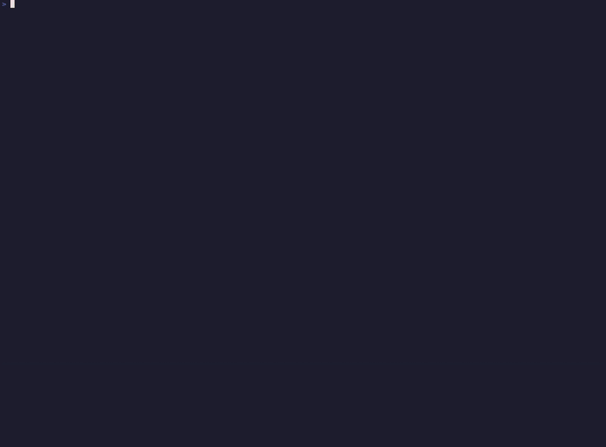

# SomaFM CLI

[](https://github.com/glebovdev/somafm-cli/actions/workflows/ci.yml)
[](https://github.com/glebovdev/somafm-cli/releases/latest)
[](LICENSE)

A terminal-based music player for [SomaFM](https://somafm.com/) radio stations built in Go.



## Features

- Stream all SomaFM radio stations
- Rich terminal UI with station browser
- Volume control with visual feedback
- Pause/resume playback
- Stations sorted by listener count
- Favorites management
- Persistent configuration (volume, favorites, last station)
- Customizable color themes
- Automatic retry on stream failure

## Installation

### macOS

```bash
brew install glebovdev/tap/somafm
```

### Linux

Download `somafm_*_linux_amd64.tar.gz` from the [Releases page](https://github.com/glebovdev/somafm-cli/releases) and extract:

```bash
tar -xzf somafm_*_linux_amd64.tar.gz
sudo mv somafm /usr/local/bin/
```

### Windows

```powershell
scoop bucket add glebovdev https://github.com/glebovdev/scoop-bucket
scoop install somafm
```

Or download `somafm_*_windows_amd64.zip` from the [Releases page](https://github.com/glebovdev/somafm-cli/releases).

### Go Install

```bash
go install github.com/glebovdev/somafm-cli/cmd/somafm@latest
```

## Usage

```bash
somafm              # Start the player
somafm --random     # Start with a random station
somafm --version    # Show version information
somafm --debug      # Enable debug logging
somafm --help       # Show help and config file path
```

## Keyboard Shortcuts

| Key                | Action               |
|--------------------|----------------------|
| `↑` `↓`            | Navigate list        |
| `Enter`            | Play selected station|
| `Space`            | Pause / Resume       |
| `<` `>`            | Previous / Next station |
| `r`                | Random station       |
| `←` `→` or `+` `-` | Volume up / down     |
| `m`                | Mute / Unmute        |
| `f`                | Toggle favorite      |
| `?`                | Show help            |
| `a`                | About                |
| `q` `Esc`          | Quit                 |

## Configuration

Configuration is saved automatically to `~/.config/somafm/config.yml`.

```yaml
volume: 70                    # Volume level (0-100)
buffer_seconds: 5             # Audio buffer size (0-60 seconds)
last_station: groovesalad     # Last played station ID
autostart: false              # Auto-play last station on launch (true/false)
favorites:                    # List of favorite station IDs
  - groovesalad
  - dronezone
theme:                        # Color customization
  background: "#1a1b25"
  foreground: "#a3aacb"
  borders: "#40445b"
  highlight: "#ff9d65"
```

Settings are saved when you adjust volume, select a station, or toggle favorites.

### Theme Options

Colors support names (`white`, `red`, `darkcyan`), hex codes (`#ff0000`), or `default` for terminal colors.

Available theme properties:

| Property | Description |
|----------|-------------|
| `background` | Main background color |
| `foreground` | Text color |
| `borders` | Border color |
| `highlight` | Selection highlight |
| `muted_volume` | Volume bar color when muted |
| `header_background` | Header section background |
| `help_background` | Help panel background |
| `help_foreground` | Help panel text |
| `help_hotkey` | Hotkey highlight color |
| `modal_background` | Modal dialog background |

## Built With

- [tview](https://github.com/rivo/tview) - Terminal UI framework
- [tcell](https://github.com/gdamore/tcell) - Terminal cell management
- [beep](https://github.com/gopxl/beep) - Audio playback
- [resty](https://github.com/go-resty/resty) - HTTP client
- [zerolog](https://github.com/rs/zerolog) - Structured logging

## About SomaFM

[SomaFM](https://somafm.com/) is listener-supported, commercial-free internet radio. If you enjoy their stations, please consider [supporting them](https://somafm.com/support/).

## License

This project is licensed under the MIT License - see the [LICENSE](LICENSE) file for details.
